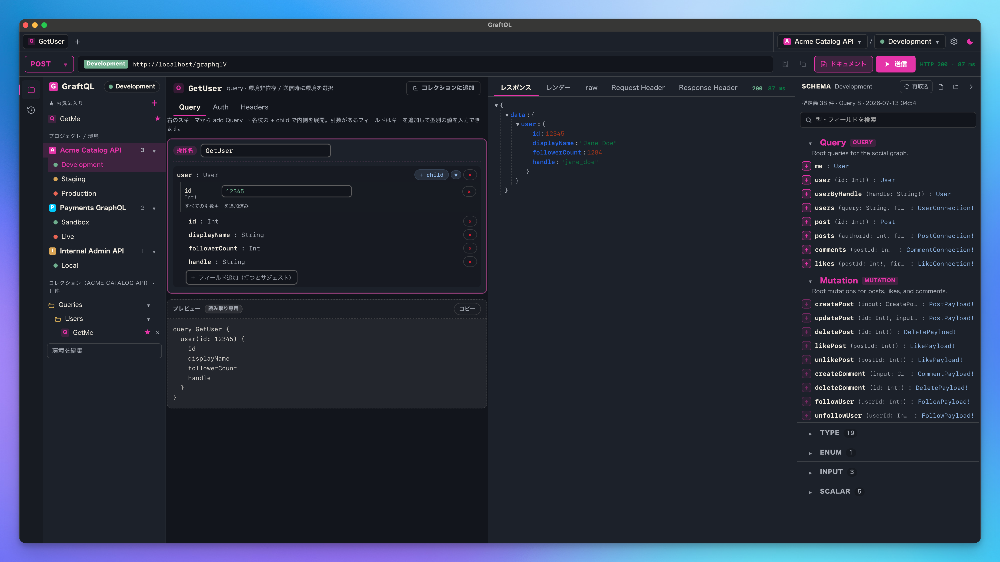

[English](./README.md) | **日本語**

# GalleonQL

  

GalleonQL は GraphQL 専用に作られたデスクトップクライアントです。スキーマを HTTP イントロスペクションで取得するため、ドキュメントを参照しながらクエリを組み立て、複数のエンドポイントに対してリクエストを送信できます。

このリポジトリは GalleonQL の**公開課題トラッカー**です。バグ報告や機能要望はこちらで受け付けます。GalleonQL 本体はクローズドソースです。

- **ウェブサイト**: https://galleonql.com/
- **ダウンロード**: [Releases](https://github.com/trimixjp/GalleonQL/releases)

## 機能

- HTTP イントロスペクションで取得した GraphQL スキーマを、リファレンスドキュメントと並べて参照できます。
- 段階的なクエリビルダー: **add Query** でルートフィールドを挿入し、**add Child** で 1 階層ずつ展開します。
- 直交型の接続プロファイル（環境）で複数のエンドポイントを切り替えます。
- 認証は方式（None / Bearer / Basic）と秘密の値を分離して扱います。
- リクエストは Rust（reqwest）バックエンドから送信するため、ブラウザの CORS 制約を受けません。
- 取得したスキーマはローカルの SQLite にキャッシュされます。

## 報告のしかた

新しい Issue を作成し、テンプレートを選んでください。

- **Bug report** — 期待どおりに動作しないとき。
- **Feature request** — 改善や新機能の提案。
- **Language request** — 新しい UI 言語のリクエスト。

どのテンプレートでも日本語での報告を歓迎します。書きやすい言語でお書きください。

## 修正の進め方

バグや要望はこの公開トラッカーで受け付けます。アプリのソースはクローズドのため、修正は非公開のソースツリーで行い、リリースとして配布します。修正が配布される際はリリースノートで告知し、該当する Issue には修正が含まれるバージョンを添えて close します。これにより各 Issue と、それを解決したリリースが常に結びつきます。

## 対応言語

GalleonQL は現在 **英語** と **日本語** を提供しています。他の言語は要望と寄付に応じて追加します。新しい言語の現在の優先順位は次のとおりです。

1. 簡体字中国語（zh-CN）
2. ブラジルポルトガル語（pt-BR）
3. スペイン語（es）
4. ロシア語（ru）
5. 韓国語（ko）
6. ドイツ語 / フランス語（de / fr）

言語をリクエストするには **Language request** の Issue を作成してください。

## ライセンス / ソース

GalleonQL は**クローズドソース**です。このリポジトリには公開課題トラッカー（README、Issue テンプレート、ラベル用スクリプト）のみが含まれます。アプリケーションのソースコードはここでは公開していません。
