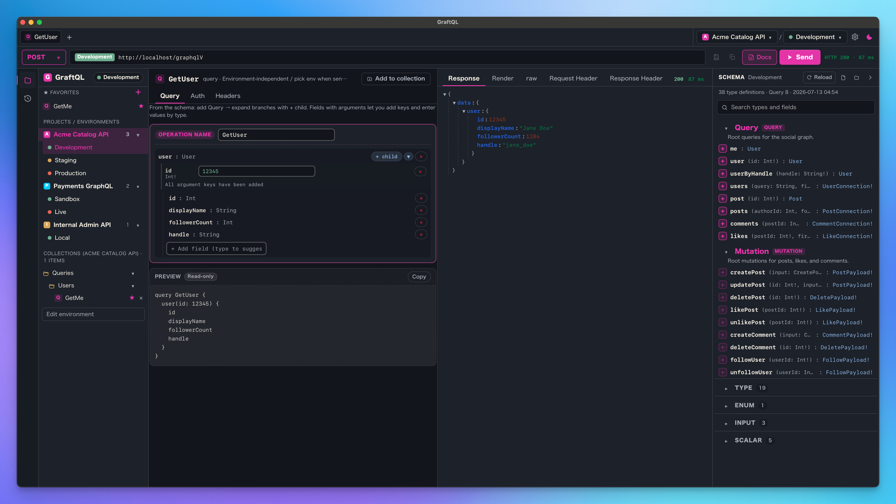

**English** | [日本語](./README-ja.md)

# GalleonQL

  

GalleonQL is a desktop client built specifically for GraphQL. It fetches a schema by HTTP introspection so you can browse the documentation while you build queries, then send requests to one of several endpoints.

This repository is the **public issue tracker** for GalleonQL — report bugs and request features here. GalleonQL itself is closed-source.

- **Website**: https://galleonql.com/
- **Download**: [Releases](https://github.com/trimixjp/GalleonQL/releases)

## Features

- Browse a GraphQL schema fetched via HTTP introspection, with reference documentation alongside the builder.
- Incremental query builder: **add Query** inserts a root field, **add Child** expands one level at a time.
- Switch between multiple endpoints using orthogonal connection profiles (environments).
- Authentication keeps the method (None / Bearer / Basic) separate from the secret value.
- Requests are sent from the Rust (reqwest) backend, so there are no browser CORS restrictions.
- Fetched schemas are cached locally in SQLite.

## How to report

Open a new issue and pick a template:

- **Bug report** — something isn't working as expected.
- **Feature request** — suggest an improvement or new capability.
- **Language request** — ask for a new UI language.

Japanese is welcome in every template — write in whichever language is easier for you.

## How fixes are handled

Bugs and requests are received here in the public tracker. Because the application source is closed, fixes are made in the private source tree and shipped in a release. When a fix ships, it is announced in the release notes, and the corresponding issue is closed with a note pointing to the version that contains the fix. This keeps each issue linked to the release that resolves it.

## Languages

GalleonQL currently ships in **English** and **Japanese**. Additional languages are added based on demand and donations. The current priority order for new languages is:

1. Simplified Chinese (zh-CN)
2. Brazilian Portuguese (pt-BR)
3. Spanish (es)
4. Russian (ru)
5. Korean (ko)
6. German / French (de / fr)

To request a language, open a **Language request** issue.

## License / Source

GalleonQL is **closed-source**. This repository holds only the public issue tracker — the READMEs, issue templates, and label tooling. The application source code is not published here.
